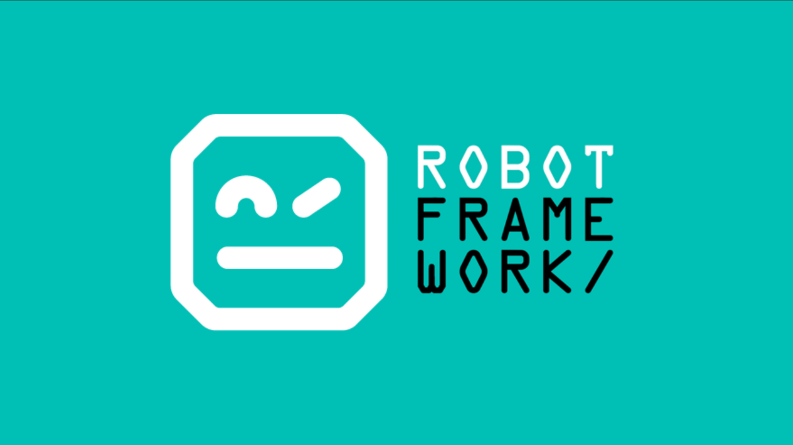

# Robot Framework Sample Script

## Tools and Framework Used.
* Language: Python
* Language version: 3.9.0
* Selenium
* brew
* Webdriver: Chrome
* Framework: Robot Framework
* Framework version: Check requirements.txt file
* IDE: Pycharm (Community Edition)
* OS: macOS (Catalina 10.15.7)

## Setup
### Recommendation
I will recommend that a virtual environment be set up
within the project to run locally. You can use pyenv or 
virtualenv to set up. This will allow the dependencies and
libraries installed to be inside the project alone.

Once the virtual environment has been setup and activated,
proceed to install the libraries in the `requirements.txt` file with the 
command `pip install -r requirements.txt`.

### Execution

You can run the project locally with
* `robot tests/` if you want to run the whole test
* `robot -d results tests/` if you want to run the whole test and save the result
in the folder named Result
* `robot -d results -i per-01 tests/` if you want to run a specific tag in the test suite.

## What does this script do?

The Script launches a bitcoin site (that has been redacted) and simulates the following processes
* Login
* Buy Cryptocurrency (Bitcoin)
* Sell Cryptocurrency (Bitcoin)
